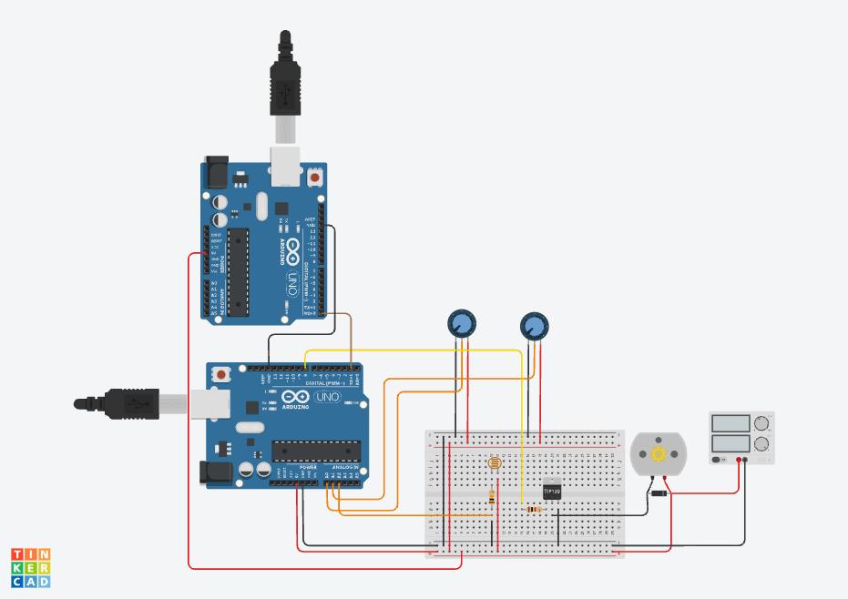

# 🌱 Smart Irrigation System — IoT + Edge AI (Dose-Based Control)

York St John University — **COM6017M: The Internet of Things (Level 6)**  

---

## 1) Project Overview

This project implements a **Smart Irrigation System** that combines **IoT**, **Machine-to-Machine (M2M) communication**, **Edge AI**, and **cloud analytics** to automate watering based on real sensor data.

Unlike basic timer-based irrigation, this system performs **local decision-making at the edge**:
- A **rule-based gate with hysteresis** decides **WHEN** to irrigate (safe and explainable).
- A **Random Forest dose regressor** predicts **HOW MUCH** to irrigate (pump duration in seconds), running on a **Raspberry Pi Edge AI node**.

Telemetry and decisions are uploaded to **ThingSpeak** for monitoring and analysis.

---

## 2) Problem Statement

Manual irrigation and fixed schedules often waste water and fail to adapt to changing conditions (soil moisture drift, indoor heating, humidity, day/night cycles). This project addresses that by:
- continuously sensing soil and environment,
- making control decisions locally (Edge AI),
- applying controlled irrigation doses via a peristaltic pump,
- logging and visualising the system behaviour in the cloud.

---

## 3) Key Features

- **Real sensors**: 2× soil moisture, DHT22 (temperature + humidity), LDR (light)
- **Closed-loop control**: sensor → edge inference → command → actuator
- **M2M communication**:
  - **UART**: Arduino ↔ ESP32
  - **Bluetooth SPP**: ESP32 ↔ Raspberry Pi
- **Edge AI**:
  - ON/OFF gating using **soil_avg hysteresis**
  - Dose selection using **RandomForestRegressor** (seconds)
- **Cloud visibility (ThingSpeak)**:
  - live telemetry, decision flag, and watering duration
- **Safety-first actuation**:
  - timed pump activation, clamp limits, and a dry-run mode

---

## 4) System Architecture

### 4.0 Architecture Diagrams

The following diagrams document the overall design and data flow of the system:

#### System Context Diagram
<p align="center">
  
</p>

#### Data Flow Diagram (M2M)
<p align="center">
  
</p>

#### Hardware Architecture Diagram
<p align="center">
  
</p>

### 4.1 Roles

- **Arduino UNO R4 WiFi (Sensor + Actuator Node)**
  - Reads sensors
  - Executes timed pump actuation via TIP122 driver
  - Sends telemetry to ESP32 via UART
  - Receives commands from ESP32 via UART

- **ESP32 (Gateway + Cloud Uplink)**
  - Parses UART telemetry from Arduino
  - Forwards telemetry to Raspberry Pi over Bluetooth SPP
  - Receives control commands from Raspberry Pi and relays them to Arduino
  - Uploads telemetry + decisions to ThingSpeak over HTTP

- **Raspberry Pi (Edge AI Node)**
  - Receives telemetry via Bluetooth SPP
  - Runs real-time control logic:
    - ON/OFF hysteresis gate
    - Random Forest regression for pump duration
  - Sends commands back to ESP32 (`CMD:...;SEC:...`)

### 4.2 M2M Data Flow (High Level)

```text
[Soil1, Soil2, DHT22, LDR]
          ↓
 Arduino UNO R4 (sensing + actuation)
          ↓ UART
      ESP32 Gateway (routing + cloud)
          ↓ Bluetooth SPP
 Raspberry Pi (Edge AI inference)
          ↑ Bluetooth SPP commands
      ESP32 Gateway
          ↑ UART commands
 Arduino (timed pump control)

 ESP32 → ThingSpeak (HTTP)
```

> Architecture diagrams are stored in `docs/diagrams/`.

---

## 5) Control Protocol (RPi → ESP32 → Arduino)

The Raspberry Pi sends a single-line command:

```text
CMD:<WATER_ON|WATER_OFF>;SEC:<int>\n
```

Examples:
- `CMD:WATER_OFF;SEC:0`
- `CMD:WATER_ON;SEC:14`

The ESP32 forwards the same command over UART to the Arduino. The Arduino parses it deterministically and (if actuation is enabled) runs the pump for `SEC` seconds.

---

## 6) Edge AI Design

### 6.1 Baseline (Deprecated) — TinyML ON/OFF

Early iterations used a **TinyML-style binary classifier** trained on a **synthetic dataset** to validate the end-to-end pipeline (data collection → cloud → training → deployment). This baseline is kept for documentation and comparison, but it is **not** the final controller.

### 6.2 Current Production Approach — Dose-Based Edge AI

The deployed system uses a two-layer controller:

1) **ON/OFF gating (explainable, safe)**
- Computes `soil_avg = (soil1 + soil2) / 2`
- Applies **hysteresis thresholds** to prevent flapping:
  - Start watering when the soil is dry (above a dry threshold)
  - Stop watering once the soil reaches a wet threshold

2) **Dose prediction (Edge AI model)**
- A **RandomForestRegressor** predicts `watering_seconds`
- Output is snapped to an allowed set:
  - `{8, 14, 18, 24}` seconds

**Training–serving contract**
- The production model is exported with an explicit feature list to prevent silent feature-order bugs:
  - `models/rf_dose_regressor_prod.joblib`
  - `models/rf_dose_features_prod.json`

**Decision-time features only**
- Training includes a strict “production mode” filter so the model only uses features available at inference time.

---

## 7) ThingSpeak Channel Schema

The ESP32 uploads telemetry and control signals to ThingSpeak.

- **field1** → `soil1`
- **field2** → `soil2`
- **field3** → `temperature_c`
- **field4** → `humidity_percent`
- **field5** → `light_ldr`
- **field6** → `decision_flag` (`0` = WATER_OFF, `1` = WATER_ON)
- **field7** → `watering_seconds` (`0` or one of `{8,14,18,24}`)

---

## 8) Repository Structure (Key Paths)

```text
firmware/
  arduino_edge/              # Arduino sensor + actuator node
  esp32_gateway/             # ESP32 gateway: UART ↔ BT ↔ ThingSpeak
edge/
  raspberry_pi/
    app/                     # BT inference service (real-time control)
    model/                   # model loading utilities
    config/                  # runtime config
scripts/
  build_training_set.py      # window extraction + feature engineering
  train_rf_dose_model.py     # RF regressor training + evaluation
  smoke_test_prod_inference.py
models/
  rf_dose_regressor_prod.joblib
  rf_dose_features_prod.json
data/
  labels/irrigation_events.csv
docs/
  project_log.md
  diagrams/
  figures/
```

---

## 9) Quick Start (High Level)

### 9.0 Circuit Schematic (Simulation)

The electronic circuit was validated using a simulation-based approach during early development. The schematic includes:
- dual soil moisture sensors (analogue inputs),
- DHT22 temperature and humidity sensor,
- LDR for ambient light sensing,
- TIP122 transistor driver stage for the peristaltic pump.

<p align="center">
  
</p>

The simulation files and notes are stored in `hardware/tinkercad/`.

### 9.1 Hardware
- Arduino UNO R4 WiFi
- ESP32
- Raspberry Pi
- Sensors: 2× soil moisture, DHT22, LDR
- Actuator: peristaltic pump + TIP122 driver + flyback diode + base resistor

### 9.2 Run the System
1. Flash Arduino firmware: reads sensors, sends UART telemetry, receives commands.
2. Flash ESP32 gateway: reads UART telemetry, talks BT SPP to RPi, uploads to ThingSpeak.
3. On Raspberry Pi:
   - pair with ESP32 via Bluetooth SPP
   - bind RFCOMM device (e.g., `/dev/rfcomm0`)
   - run the inference service (real-time control loop)

> Detailed setup notes and development history are tracked in `docs/project_log.md`.

---

## 10) Safety Notes

- The Arduino supports a **dry-run / log-only mode** so testing can be performed without energising the pump.
- Timed irrigation uses non-blocking logic and includes a maximum duration clamp to avoid runaway watering.
- Recommended: verify pump routing into a container before watering a real plant.

---

## 11) Academic & Sustainability Context

This artefact demonstrates:
- IoT sensing + actuation
- M2M communication (UART + Bluetooth)
- Edge AI inference on-device (Raspberry Pi)
- Cloud analytics/visualisation (ThingSpeak)

It supports responsible water use and aligns with sustainable resource management goals.

---

## 12) License

MIT License.
