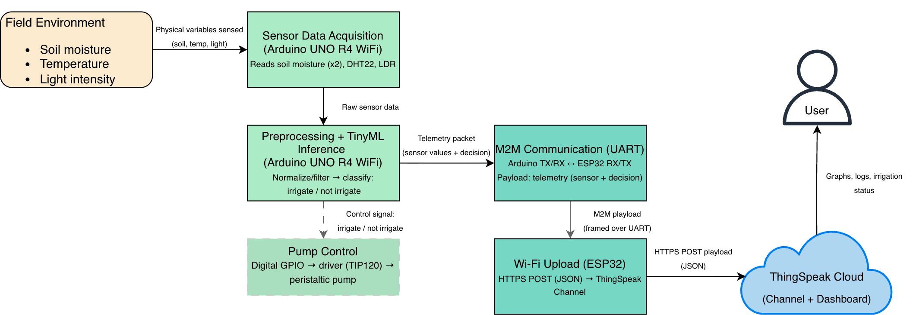

# 🌱 Smart Irrigation System – IoT + Edge AI (TinyML)

## 1. Project Overview

This project implements a **Smart Irrigation System** that leverages **Internet of Things (IoT)** and **Edge Artificial Intelligence (TinyML)** technologies to automate and optimize the watering process in diverse environments — from small private gardens to large agricultural fields.  

The system continuously monitors environmental and soil conditions through low-cost sensors and performs local inference on a **Rasberrry Pi Edge AI node** using a trained decision-tree model (or TinyML equivalent), while the **Arduino UNO R4** handles sensing and actuation and the **ESP32** manages cloud transmission to ThingSpeak.
  
Based on the prediction, it controls the irrigation mechanism autonomously while transmitting sensor data to the cloud via an **ESP32 Gateway** for visualization and analysis on **ThingSpeak Cloud**.  

By combining **local decision-making (Edge AI)** and **cloud-based analytics**, this architecture enables efficient, scalable, and sustainable water management with minimal human intervention.

---

## 2. Problem Statement

Traditional irrigation systems—whether in large agricultural fields or small private gardens—often rely on manual scheduling or fixed-timer control, leading to inefficient water use and suboptimal plant growth.  
Such approaches fail to adapt to real-time environmental conditions such as soil moisture, temperature, and light intensity, which are critical factors for plant health and sustainable water management.

This project proposes the design and implementation of a **Smart Irrigation System** based on **IoT and Edge Artificial Intelligence (TinyML)**.  
The system monitors environmental variables and autonomously decides the optimal watering action using local inference, without continuous cloud dependence.  
By integrating low-cost sensors, **Edge AI inference** on **Raspberry Pi Edge AI node**, and **cloud-based analytics** through **ThingSpeak**, the system provides a scalable solution applicable to both **small-scale home gardens** and **large agricultural environments**, ensuring **water efficiency and healthy plant growth**.

---

## 3. Objectives

- Develop a **reliable IoT-based irrigation system** capable of autonomous operation.  
- Implement **Edge AI (TinyML)** to perform on-device inference (“water” / “no water”) without cloud dependency.  
- Enable **real-time data transmission and visualization** through **ThingSpeak Cloud**.  
- Demonstrate the benefits of combining **IoT, Edge AI, and Cloud** for sustainable resource management.

---

## 4. System Architecture

> The full circuit simulation and schematic are available in `/hardware/tinkercad/`.  
> Detailed architecture diagrams are stored in `/docs/diagrams/`.

### 4.1 System Context Diagram

  

### 4.2 Data Flow Diagram (M2M)

  

### 4.3 Hardware Architecture

  

### 4.4 Components

| Category | Component | Description |
|-----------|------------|-------------|
| **Microcontrollers / Compute Nodes** | Arduino UNO R4 WiFi, Raspberry Pi (Edge AI), ESP32 (Cloud Gateway) | Distributed IoT architecture: Arduino = sensing & actuation, Raspberry Pi = Edge AI inference, ESP32 = ThingSpeak upload |
| **Sensors** | 2× Soil Moisture Sensors, DHT22, LDR | Environmental and soil condition sensing |
| **Actuator** | Peristaltic Water Pump | Controls irrigation based on Edge AI prediction from Raspberry Pi |
| **Power Supply** | 5 V / 12 V DC Adapter | Provides power to sensors, controllers and pump |
| **Connectivity** | USB Serial (Arduino ↔ Raspberry Pi), UART or Wi‑Fi (Raspberry Pi ↔ ESP32) | Local wired M2M communication for data and commands; ESP32 handles wireless cloud link |
| **Cloud Platform** | ThingSpeak | IoT data analytics, visualization and dashboards via ESP32 Gateway |

---

## 5. Data Flow Description

1. Environmental sensors collect **soil moisture**, **temperature**, and **light intensity** data.  
2. The **Arduino UNO R4** sends raw sensor readings via **USB Serial** to the **Raspberry Pi Edge AI node**.  
3. The **Raspberry Pi** applies **Min–Max normalization**, performs **Edge AI inference** (decision tree / TinyML model), and sends back pump control commands (`P1` = ON / `P0` = OFF) to the Arduino.  
4. The **Raspberry Pi** forwards the complete telemetry frame (`S1,S2,T,H,L,PRED`) to the **ESP32 gateway** through **UART or Wi-Fi**.  
5. The **ESP32** uploads the data to **ThingSpeak Cloud** using HTTPS, enabling real-time monitoring and historical analysis.  
6. ThingSpeak visualizes environmental parameters and AI predictions in its dashboard interface.

---

## 6. Edge AI (TinyML)

- The Edge AI inference is now executed on a **Raspberry Pi Edge AI node**, which receives raw sensor data from the Arduino via USB Serial.  
- The Pi applies **Min–Max normalization** (same parameters used during training) and performs inference using a **Decision Tree** or **TinyML (TFLite)** model exported from the Python environment.  
- The trained model was developed on a **custom dataset** of environmental parameters stored in `/data/dataset.csv`.  
- **Classification goal:**  
  - `0 → No Water`  
  - `1 → Water`  
- The inference output (`PRED`) is used to control the irrigation pump through serial commands sent back to the Arduino (`P1` = ON / `P0` = OFF).  
- This design ensures:  
  - **Low latency** and **offline operation** via local inference.  
  - **Modular scalability**, since the Pi can run Python (sklearn/TFLite) models and even retrain or update them autonomously.  
  - **Energy efficiency**, as the Arduino only performs sensing and actuation.

---

## 7. Cloud Platform (ThingSpeak)

- **Platform:** MATLAB ThingSpeak IoT Analytics  
- **Channel Fields:**
  - `field1` → Soil Moisture Sensor 1  
  - `field2` → Soil Moisture Sensor 2  
  - `field3` → Air Temperature  
  - `field4` → Light Intensity (LDR)  
  - `field5` → TinyML Prediction (0 / 1)
- Provides real-time **graphical visualization** and **data logging**.  
- Dashboard screenshots and analysis results are stored in `/docs/media/`.

---

## 8. Firmware Structure

The `firmware` directory contains two independent but connected modules:

### 8.1 Arduino UNO R4 WiFi (Sensor & Actuator Node)
**Path:** `/firmware/arduino_edge/`

Responsibilities:
- Acquire raw sensor and environmental readings (soil moisture, temperature, humidity, light).  
- Transmit sensor frames via **USB Serial** to the Raspberry Pi Edge AI node.  
- Receive pump control commands (`P1` / `P0`) from the Raspberry Pi and activate or deactivate the peristaltic pump accordingly.  
- Provide serial feedback confirming pump state.

### 8.2 ESP32 (Communication Gateway)
**Path:** `/firmware/esp32_gateway/`

Responsibilities:
- Receive complete telemetry frames (`S1,S2,T,H,L,PRED`) from the Raspberry Pi via UART or Wi-Fi.  
- Manage Wi-Fi connectivity and HTTPS communication.  
- Upload telemetry and AI predictions to **ThingSpeak Cloud** for visualization.

### 8.3 Raspberry Pi (Edge AI Node)
**Path:** `/raspberry/`

Responsibilities:
- Receive raw sensor readings from the Arduino UNO R4 via **USB Serial**.  
- Apply **Min–Max scaling** and perform **Edge AI inference** using a trained decision-tree or TinyML model.  
- Send control commands (`P1` / `P0`) back to the Arduino based on inference results.  
- Forward full telemetry to the ESP32 gateway for cloud upload.  
- Optionally run as a background `systemd` service on boot for autonomous operation.

---

## 9. System Design (Tinkercad Simulation)

The electronic circuit was simulated using **Tinkercad** for early validation of sensor readings and pump control.  
Components include:
- Two soil moisture sensors (analog inputs).  
- DHT22 for temperature and humidity.  
- LDR for light intensity.  
- TIP120 transistor driver for the peristaltic pump.  

The public simulation link and configuration details are provided in `/hardware/tinkercad/README.md`.

---

## 10. Data Collection and Model Evaluation

- Data recorded under varying environmental conditions.  
- Stored in `/data/dataset.csv`.  
- Used for TinyML model training and validation.  
- Evaluation metrics include **accuracy**, **precision**, **latency**, and **memory footprint**.  
- Graphical summaries and logs are archived in `/docs/media/`.

### 10.1 Baseline and Synthetic Dataset (Initial Phase)

During the early stage of the project, a **synthetic dataset** was created to validate the complete end-to-end pipeline, including data preprocessing, model training, TinyML export, and edge deployment.

This baseline dataset was **not based on real sensor measurements** and was intentionally used only for:
- Pipeline validation
- Early model prototyping
- Testing TinyML deployment constraints

Once the physical Smart Irrigation System became fully operational, the synthetic dataset was **deprecated** and replaced by a **real-world dataset collected from the live system**, covering multiple irrigation cycles (LOW, MEDIUM, HIGH, SUPER-HIGH).

All experiments, evaluations, and conclusions presented in this project are based **exclusively on real sensor data**.

---

## 11. Dashboard and Visualization

The **ThingSpeak Dashboard** provides real-time insights into environmental parameters and irrigation actions.  
Displayed metrics include:
- Soil moisture (2 channels)  
- Temperature  
- Light intensity  
- Irrigation decision (binary)  
- Calculated water efficiency metric  

---

## 12. Project Roadmap

| Week | Focus | Deliverables |
|------|--------|--------------|
| 1 | Architecture & Planning | Problem statement, diagrams, GitHub repository |
| 2–3 | Hardware Setup | Sensor validation, UART communication |
| 4–5 | Data Collection & Model Training | Dataset creation, TinyML model |
| 6 | Cloud Integration | ThingSpeak dashboard setup |
| 7 | Testing & Validation | End-to-end data flow testing |
| 8–9 | Report Writing | Academic report draft |
| 10 | Final Presentation | Demonstration video and project defense |

---

## 13. Tools and Technologies

- **Arduino IDE / PlatformIO** — firmware development  
- **TensorFlow Lite Micro** — TinyML model deployment  
- **ThingSpeak IoT Analytics** — cloud storage and visualization  
- **Tinkercad / Draw.io** — circuit and diagram design  
- **GitHub** — version control and documentation  
- **Python** — data preprocessing and model training  

---

## 14. Security and Ethics

- No personal or sensitive data are collected.  
- Implements **data minimization** and **privacy-by-design** principles.  
- Aligns with **UN Sustainable Development Goal 6 (Clean Water and Sanitation)** by promoting responsible water use through automated control.  
- Follows **Responsible IoT design** principles ensuring transparency, accessibility, and scalability.

---

## 15. License

Licensed under the **MIT License**.  
This project may be reused for educational or research purposes with appropriate citation.

---

## 16. Academic Context

**Institution:** York St John University  
**Module:** *The Internet of Things (Level 6)*  
**Project Type:** Individual IoT + Edge AI Artefact + Technical Report  
**Submission Deadline:** 16 January 2026  
