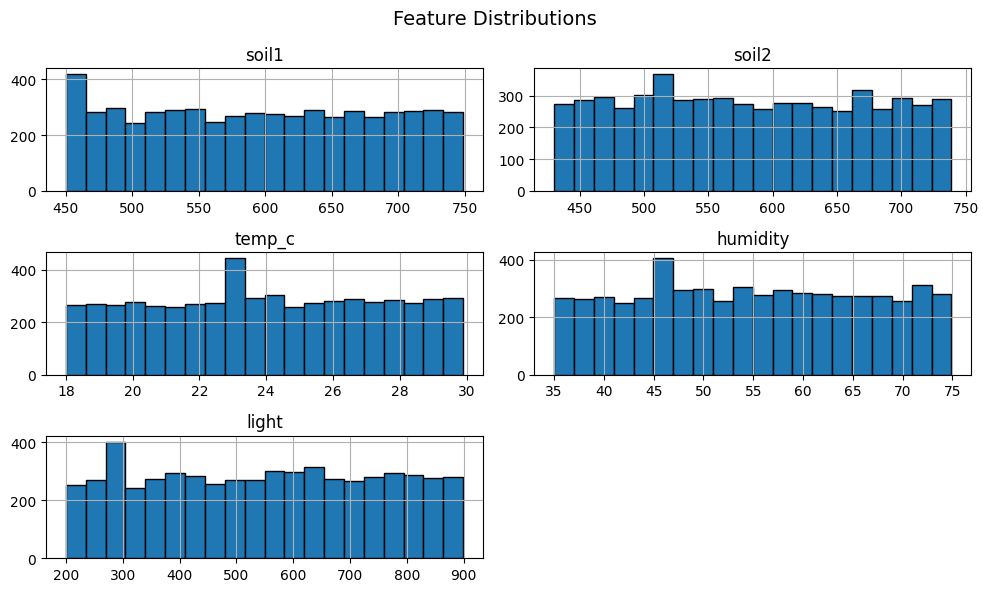
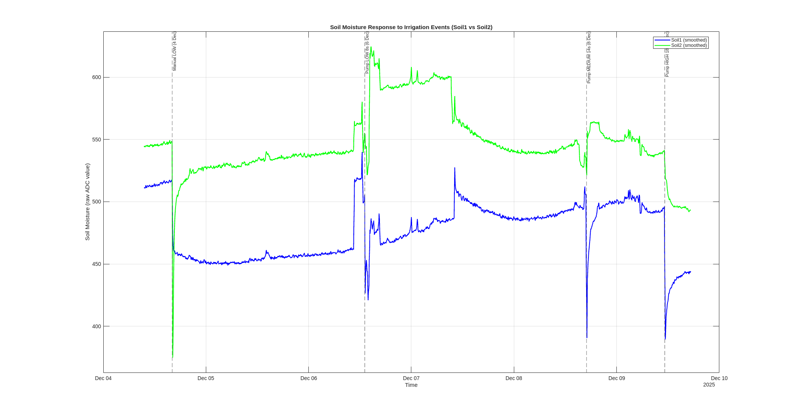

# Project Development Log – Smart Irrigation System (IoT + Edge AI)

## Context
York St John University – Module COM6017M: The Internet of Things  
Student: Victor López  
Supervisor: Dr. Aminu Usman  
Credits: 20 (Portfolio Assessment – 2000 words report + artefact)

---

## 🔹 Week 1 – System Setup and Planning
**Date:** 13–19 October 2025  

- Defined project problem: inefficient water use in plant irrigation.  
- Designed IoT architecture: sensors → Arduino UNO (TinyML) → UART → ESP32 → ThingSpeak Cloud → Pump.  
- Created GitHub repo and README (English only).  
- Produced circuit and data flow diagrams using Tinkercad and Draw.io.  
- Installed required hardware libraries and set up PlatformIO for ESP32 gateway.

---

## 🔹 Week 2 – Cloud Integration (ThingSpeak)
**Date:** 20–26 October 2025  

- Implemented UART-ready gateway on ESP32 with HTTP connection to ThingSpeak.  
- Verified Wi-Fi connection and API integration (`HTTP Response: 200`).  
- Generated simulated sensor data locally and uploaded to ThingSpeak (fields 1–6).  
- Achieved successful data visualization on cloud dashboard.  
- Created documentation: `dataset_description.md` and TinyML dataset structure.  
- Left the system running to collect continuous random data (approx. 1,000+ entries per day).  

**Reflection:**  
The cloud pipeline works reliably. Data transmission frequency limited to 16 s to comply with ThingSpeak free-tier API restrictions.  
Next steps: export dataset, clean data in Python, and prepare TinyML model.

## Upcoming Tasks
- Export CSV from ThingSpeak (dataset_raw.csv)  
- Clean and normalize data (dataset_clean.csv)  
- Perform exploratory analysis (EDA)  
- Train TinyML binary classifier (“irrigate / not irrigate”)  
- Integrate model with Arduino UNO via TensorFlow Lite

## Files Created So Far
| File | Purpose |
|------|----------|
| `tinkercad_circuit_complete.png` | Circuit simulation |
| `hardware_architecture.drawio.jpeg` | Hardware architecture |
| `system_context_diagram.drawio.png` | System context |
| `esp32_gateway/main.cpp` | Cloud gateway firmware |
| `arduino_edge/arduino_edge.ino` | Edge device firmware |
| `docs/dataset_description.md` | Dataset description and preprocessing plan |
| `docs/project_log.md` | Project development record |

---

## 🔹 Week 3 – Dataset Preparation
**Date:** 27 October – 2 November 2025  

**Date: 27 October 2025**
- Created and activated a Python virtual environment (`.venv`) for data analysis.
- Installed ipykernel, pandas, and matplotlib libraries.
- Imported dataset from ThingSpeak (`dataset_clean.csv`).
- Cleaned column names (field1-field6 -> soil1, soil2, temp, humidity, light, decision).
- Removed non-numeric and missing values.
- Performed Exploratory Data Analysis (EDA) in Jupyter Notebook:
    - Generated descriptive statistics (df.describe())
    - Verified balanced binary labels
    - Plotted histograms for all sensor variables.
    - Computed correlation matrix and heatmap between features and decision.
    
    *Fugure - Feature Distribution of the simulated sensor dataset.*
- The dataset was confirmed to be clear and structurally ready for TinyML preprocessing.
**Reflection:**
The EDA confirmed that the simulated data follows consistent numeric ranges and a balanced decision distribution.
Although the dataset is syntethic, it still successfully validates the complete data pipeline from Arduino -> ESP32 -> ThingSpeak -> Python, enabling the next step of normalization and TinyML training.

**Date: 28 October 2025**
- Normalized sensor features to a [0, 1] range using `MinMaxScler` and split the dataset into training (80%) and testing (20%) subsets.
- Trained a baseline **Decision Tree Classifier** (max_depth=5) to simulate TinyML inference behavior.
- Achieved 100% accuracy on the simulated dataset, as the model correctly captured the same logic used for label generation (`irrigate = 1 if soil1 > 600 or soil2 > 600`).
- Visualized the decision structure confirming that `soil1` and `soil2` dominate the irrigation rule.
- Exported the trained model and scaler as `.joblib` files, along with metadata for future TensorFlow Lite conversion.

The baseline model validates the entire IoT -> Cloud -> TinyML pipeline.
While the dataset is synthetic, the model perfectly reflects the irrigation logic, confirming data consistency and feature relevance.
This phase completes the data preprocessing and establishes a foundation for deploying the classifier on Arduino via TensorFlow Lite (TinyML comversion - next phase)

**Date: 30 October 2025**
- Exported `baseline_decision_tree` rules to C++ format using Python function `emit_rules_as_cpp()`.
- Generated the header file `predict_need_water.h` containing the decision logic (if/else structure).
- Created `scaler.h` implementing Min-Max normalization with `DATA_MIN` and `DATA_MAX` arrays based on dataset statistics.
- Integrated both headers into the Arduino firmware (`arduino_edge.ino`) to enable on-device inference without external ML libraries.
- Successfully compiled and uploaded to Arduino UNO R4 WiFi.
- Verified live sensor readings:
S1:288, S2:231, T:20.2, H:65.2, L:283, PRED:0
confirming that the model runs locally and produces binary irrigation predictions (`0 = no irrigation`, `1 = irrigation`).
- Performed sensor calibration and debugging of the DHT22 module; replaced defective sensor and confirmed stable temperature/humidity readings.
- Added serial telemetry output (`S1,S2,T,H,L,PRED`) for UART communication with the ESP32 gateway.

**Reflection:**  
This week concludes the TinyML and Edge AI phase.  
The decision-tree classifier was successfully deployed on the Arduino UNO R4 and performs local inference in real time.  
The device now operates autonomously—collecting, normalizing, and classifying sensor data without cloud dependency—meeting the Edge AI objectives for latency reduction and offline resilience.  
Next step: integrate UART communication with the ESP32 to upload telemetry and predictions to ThingSpeak Cloud.
This successful implementation on Arduino establishes the baseline for migrating the Edge AI inference to a Raspberry Pi node in the next development phase, where higher computational capacity and logging capabilities will be leveraged.

---

End of Week 3 – TinyML Edge AI successfully running on Arduino UNO R4.

## 🔹 Week 4 - Edge AI Deployment and System Integration
**Date:** 3–9 November 2025  

- Installed and configured the Raspberry Pi as the new Edge AI node for running local TinyML inference, replacing the Arduino UNO’s limited computation.  
- Structured the directory `edge/raspberry_pi/` with modular subfolders (`app/`, `config/`, `model/`, `system/`) to follow clean software architecture practices.  
- Migrated the TinyML model (`baseline_dense.tflite`) and scaler (`minmax_scaler_keras.joblib`) into the Raspberry Pi environment.  
- Set up a dedicated Python virtual environment (`.venv-tflite`) and installed required dependencies (`numpy`, `joblib`, `tflite_runtime`, later replaced by `tensorflow-macos` for testing on macOS).  
- Implemented and tested the script `inference_test.py`, capable of loading the TFLite model, applying normalization, and executing local inference to predict the irrigation decision (`WATER_ON` / `WATER_OFF`).  
- Resolved import and compatibility issues with TensorFlow Lite runtime on macOS, ensuring smooth fallback execution.  
- Validated the complete inference process using simulated sensor readings, confirming consistency between the model output and the expected decision logic.  
- Verified correct usage of the final scaler (`minmax_scaler_keras.joblib` – 6-feature pipeline including `soil_max`).  

**Results:**  
- Successful local inference on the Raspberry Pi using the 6-feature input vector `[soil1, soil2, soil_max, temp_c, humidity, light]`.  
- Model prediction verified with stable output:  

[RESULT] Model raw output: [[0.006]]
[RESULT] Decision: WATER_OFF

- This confirms that the TinyML model and scaler are aligned, and the Raspberry Pi can now perform autonomous inference.  

**Reflection:**  
This phase marks the transition from microcontroller-level inference to a more capable Edge AI platform (Raspberry Pi).  
The system now supports faster inference, local processing, and future scalability (e.g., data logging, OTA updates, or advanced models).  
Next steps involve enabling UART communication between the Raspberry Pi and ESP32 for real-time data exchange.

---

## 🔹 Week 5 – Migration from UART to Bluetooth M2M (ESP32 ↔ Raspberry Pi)
**Date:** 10–16 November 2025  

- Created new Git branch `feat/m2m-esp32-rpi-bluetooth` to migrate the communication layer from UART to Bluetooth SPP for cleaner, wireless M2M operation.  
- Implemented a full Bluetooth Serial Port Profile (SPP) gateway on the ESP32 (`main.cpp`), including:
  - Device name `SIS-ESP32-GW`
  - Reconnection-safe SPP initialisation
  - Periodic telemetry transmission simulating sensor data (`S1,S2,T,H,L`)
  - Bluetooth RX handling for irrigation decisions from the Raspberry Pi  
- Enabled Bluetooth SPP on the Raspberry Pi using `bluetoothctl` and persistent RFCOMM binding to `/dev/rfcomm0`.  
- Added new Raspberry Pi module: `edge/raspberry_pi/bt_inference_service.py`, implementing:
  - Continuous Bluetooth line reading  
  - Telemetry parsing  
  - Construction of the 6‑feature vector (`soil1, soil2, soil_mean, temp, hum, light`)  
  - Real‑time inference using the TinyML TFLite model  
  - Transmission of irrigation decisions (`DECISION:WATER_ON` / `DECISION:WATER_OFF`) back to the ESP32  
- Updated `EdgeIrrigationModel` for stable inference inside the constrained Python 3.7 environment of the Raspberry Pi.  
- Verified complete M2M loop (ESP32 → RPi → ESP32) with simulated data.  
- Confirmed pump‑control simulation on ESP32 based on received decisions.  
- Updated repository and Pull Requests to reflect Bluetooth‑based communication architecture.

**Results:**  
- Fully functional wireless communication bridge using Bluetooth SPP.  
- Stable exchange rate of telemetry and decisions over `/dev/rfcomm0`.  
- Verified bidirectional M2M loop:
  - ESP32 → sends telemetry  
  - RPi → parses + runs TFLite model + sends back decision  
  - ESP32 → logs and simulates pump ON/OFF  
Migrating from UART to Bluetooth improved modularity, safety, and simplified wiring.  
This change modernises the M2M layer and enables future OTA updates or external devices to subscribe to telemetry wirelessly.  
The Bluetooth link is now the backbone of the system, enabling a clean separation between sensing/actuation (ESP32) and inference (Raspberry Pi).

---

## 🔹 Week 6 – Full System Simulation & ThingSpeak Reintegration
**Date:** 17–23 November 2025  

During Week 6, the entire IoT + Edge AI architecture was successfully validated as a complete end-to-end system. Althoug the real pump hardware has not yet arrived, the full behaviour of the irrigation pipeline was reproduced through high-fidelity simulation: synthetic sensor generation on ESP32, Bluetooth based M2M communication with the Raspberry Pi, real time TinyML inference, and cloud telemetry upload to ThingSpeak.

Bluetooth M2M loop (ESP32 <-> Raspberry Pi)
-	Activated the ESP32 gateway in Bluetooth SPP mode, transmitting synthetic sensor readings (soil1, soil2, temp, humidity, light) to emulate the final sensor array.
-	Established a persistent RFCOMM binding on the Raspberry Pi (/dev/rfcomm0) to receive telemetry and return irrigation decisions wirelessly.
-	Executed the finalised bt_inference_service.py, which:
  -	Reads and parses incoming telemetry lines
  -	Constructs the 6-feature vector required by the TinyML model
  -	Loads the MinMax scaler and TFLite model
  -	Performs real-time inference
  -	Sends DECISION:WATER_ON or DECISION:WATER_OFF back to the ESP32
-	Verified the full M2M loop:
  -	ESP32 → RPi: telemetry over Bluetooth
	-	RPi: inference + decision
	-	RPi → ESP32: decision delivered
	-	ESP32: pump control simulation printed as logs

Result:
A stable, wireless M2M architecture with low latency and correct inference behaviour. The ESP32 successfully parsed all decisions and simulated actuator control (Activating pump / Stopping pump).

ThingSpeak Reintegration
-	Integrated cloud upload into the new Bluetooth-based ESP32 gateway.
-	Extended the HTTP payload to include the irrigation decision from the Raspberry Pi (field6).
-	Achieved consistent uploads every 20 seconds, with HTTP Response: 200 confirming packet integrity.
-	Validated real-time data flow through the ThingSpeak Data View, confirming correct values for all six fields.
-	Configured updated visualisations in the dashboard.
-	Field 6 displayed clear alternation between 0 and 1, matching dry/wet simulation cycles and TinyML predictions.

Result:
The cloud pipeline once again provides complete visibility into both raw telemetry and autonomous irrigation decisions.

Preparation for Real Hardware Deployment
-	Reviewed hardware requirements for pump integration (relay, wiring, flyback diode, 12V PSU, peristaltic pump).
-	Defined GPIO pin for pump relay control on ESP32 (planned: GPIO 23).
-	Added firmware logic for pump activation, currently simulated via serial logs until real hardware is connected.

Documentation and Architecture Updates
-	Updated the Data Flow Diagram (DFD) to reflect:
-	UART telemetry from Arduino → ESP32
-	Bluetooth SPP telemetry + decisions between ESP32 ↔ Raspberry Pi
-	HTTP upload to ThingSpeak
-	Identified remaining diagrams requiring revision (SCD and Hardware Architecture).
-	Organised files in docs/diagrams/ and prepared for final architectural update in Week 7.

Reflection

Week 6 represents a major milestone: the complete Smart Irrigation System operates autonomously, from sensing and Bluetooth M2M inference to cloud synchronisation.
Despite relying on synthetic values for now, the behaviour fully mirrors the intended real-world operation. The modular architecture (Arduino → ESP32 → Raspberry Pi → Cloud) is now stable, scalable, and ready for physical deployment once the pump and wiring components arrive.

The successful reintegration of ThingSpeak, combined with real-time Edge AI inference and wireless communication, demonstrates the maturity of the system and sets the stage for final hardware integration and diagram refinement in Week 7.

## 🔹 Week 7 – Real Hardware Integration & Architecture Finalisation
**Date:** 24-30 November

**This week marked the transition from simulation to real hardware operation, with all major system components integrated and tested using actual sensor data and physical wiring. The focus was on finalising the firmware, wiring up the pump control circuit, and aligning all documentation and diagrams with the deployed architecture.**

Arduino Hardware Integration (Real Sensors + TIP122 Pump Driver)
- Installed the real soil moisture sensors (A0, A1), DHT22 (digital pin 7), and LDR (A2) onto the breadboard, referencing the updated hardware pinout.
- Cleaned and refactored the Arduino firmware (`arduino_edge.ino`):
  - Removed all TinyML-related legacy code and headers (predict_need_water.h, scaler.h, etc).
  - Streamlined code to:
    - Read live sensor values.
    - Transmit telemetry via Serial1 (UART) to the ESP32 in the format:  
      `S1:<val>,S2:<val>,T:<val>,H:<val>,L:<val>`
    - Receive pump commands (`DECISION:WATER_ON` or `DECISION:WATER_OFF`) from the ESP32.
    - Control the pump using a TIP122 transistor and flyback diode (final soldering pending).
- Verified successful compilation, upload, and UART transmission.

Arduino now serves as a robust, dedicated sensor/actuator node, transmitting real sensor data and accepting actuator commands, ready for deployment as soon as the pump is soldered.

Wiring & Pump Control Circuit (TIP122 Transistor Stage)
- Designed and partially assembled the low-side switching circuit for pump control:
  - TIP122 NPN Darlington transistor (motor driver)
  - 1N4007 flyback diode (inductive load protection)
  - 1kΩ base resistor
  - Shared ground (GND) between Arduino, ESP32, and the 12V PSU
- Breadboarded the circuit and double-checked current flow and diode orientation.

Pump control hardware is electrically prepared, with final soldering to be completed before live motor testing.

ESP32 Gateway Adjustments (UART from Arduino)
- Modified ESP32 firmware to:
  - Accept UART telemetry from the Arduino (replacing previous synthetic data).
  - Parse incoming lines in the expected CSV format.
  - Forward telemetry over Bluetooth SPP to the Raspberry Pi for inference.
  - Relay irrigation decisions received from the Pi back to the Arduino.
- Confirmed stable end-to-end data flow and proper parsing.

ESP32 now functions as a reliable gateway between the Arduino and Raspberry Pi, supporting the final three-tier pipeline:  
`Arduino → ESP32 → Raspberry Pi`

Raspberry Pi Edge AI Confirmation
- Re-tested the Bluetooth M2M service with real sensor data from the Arduino.
- Ensured the TFLite model and MinMax scaler processed the new data format without issues.
- Verified the full decision loop:
  - Telemetry (from Arduino) → Inference (on Pi) → Decision (to ESP32) → Actuation (on Arduino).

The Pi inference service is fully compatible with live hardware data, completing the real-world M2M inference cycle.

Documentation & Diagram Updates
- Updated hardware pinout tables to show TIP122 transistor replacing relay for pump control.
- Updated the Data Flow Diagram (DFD) to reflect:
  - UART telemetry: Arduino → ESP32
  - Bluetooth SPP: ESP32 ↔ Raspberry Pi
  - HTTP upload to ThingSpeak
- Identified other diagrams (SCD, Hardware Architecture) requiring final revision in Week 8.
- Cleaned and reorganised repository directories to match the final deployment structure.

**Reflection:**  
Week 7 was the consolidation and deployment phase, transforming the simulated system into a physical IoT solution. The Arduino now reads real sensors and actuates the pump, the ESP32 acts as a robust gateway, and the Raspberry Pi delivers live TinyML inference. The pump control hardware is ready for final wiring and safety checks. All documentation and diagrams are being brought in line with the deployed system.

The Smart Irrigation System is now positioned for full real-world testing in Week 8, pending final pump integration and PSU wiring.

⸻

## 🔹 Week 8 – Real Pump Deployment, Live Irrigation Test & Data Collection for Advanced Edge AI
**Date:** 01–07 December 2025  

**This week marked the transition from a fully simulated irrigation pipeline to a complete physical deployment with a real plant, a soldered pump circuit, and long‑running data collection to prepare for a more advanced Edge AI model.**

### Real Pump Hardware Integration (TIP122 + Peristaltic Pump)

- Completed soldering of the TIP122 low‑side switching stage for the peristaltic pump, including:
  - TIP122 NPN Darlington transistor as the power stage.
  - 1N4007 flyback diode across the pump terminals for inductive load protection.
  - 1 kΩ base resistor between Arduino digital pin 8 (`PUMP_PIN`) and the TIP122 base.
  - Common ground between Arduino, ESP32 and the USB power supply.
- Verified wiring and polarity on breadboard before leaving the circuit running unattended:
  - Confirmed that the pump only activates when the Arduino sets `PUMP_PIN` HIGH.
  - Checked that the diode orientation (band towards positive) correctly clamps voltage spikes.
  - Ensured that no current flows through the pump when the system is idle.
- Prepared the mechanical setup (tubing and water source) for future automated irrigation using the peristaltic pump.

### Timing Refactor – From 2‑Second Demo Mode to 3‑Minute Irrigation Timescale

- Refactored Arduino firmware (`arduino_edge.ino`) to use a non‑blocking timing strategy based on `millis()`:
  - Replaced the fixed `delay(2000)` loop with a 3‑minute sampling interval (`SAMPLE_INTERVAL_MS = 180000`).
  - Sensor acquisition and UART telemetry to the ESP32 now trigger once every 3 minutes instead of every 2 seconds.
  - Kept `handleIncomingDecision()` running continuously so that pump commands can be applied immediately without blocking delays.
- Updated ESP32 gateway firmware (`firmware/esp32_gateway/main.cpp`) to align with the new sampling period:
  - Set `SEND_INTERVAL_MS` to 180000 ms so telemetry is forwarded to the Raspberry Pi over Bluetooth SPP once every 3 minutes, avoiding repeated resending of identical samples.
  - Set `TS_UPLOAD_INTERVAL` to 180000 ms so ThingSpeak receives one coherent data point per 3‑minute cycle.
  - Confirmed that the gateway correctly buffers the most recent telemetry and only uploads fresh readings.

### Long‑Running Data Logging on the Raspberry Pi

- Extended the Bluetooth inference service (`edge/raspberry_pi/app/bt_inference_service.py`) to log each inference event to a local CSV file on the Raspberry Pi:
  - Logged fields per row: timestamp, soil1, soil2, temperature, humidity, LDR, model probability, predicted label, and decision string (`WATER_ON` / `WATER_OFF`).
  - Ensured that CSV logging is append‑only and created with a header row on first use.
- Left the system running continuously for several days with a real potted plant connected to the sensors:
  - Collected high‑resolution time‑series data every 3 minutes, including natural day/night cycles and indoor heating effects.
  - Verified that the LDR signal follows realistic daylight patterns (low at night, high during the day, smooth transitions at sunrise/sunset with occasional peaks due to indoor lights).
  - Observed a gradual increase in soil moisture readings over multiple days, representing a real drying process of the substrate.

### First Real Irrigation Event – Manual Low‑Dose Watering

- After several days of natural drying, performed the first real irrigation event to capture a complete “dry → irrigate → wet” cycle in the dataset:
  - **Irrigation timestamp:** Thu 4 Dec 2025, 16:06:51 GMT (manual watering event recorded for later labelling).
  - Applied a small manual watering equivalent to a “low dose” (short irrigation) to avoid over‑saturating the plant.
  - Left the system running so that subsequent 3‑minute samples captured the immediate drop in soil sensor values and the slower post‑irrigation stabilisation.
- This event will later be annotated in the CSV as a low‑dose irrigation example and used as ground truth for training a more advanced ML model (multi‑class dose prediction instead of a simple ON/OFF decision).

### Second Controlled Irrigation Event – Timed Low‑Dose Pump Watering (8 s)

- After the substrate returned to a clearly dry state (soil1 and soil2 reaching values comparable to the pre‑irrigation baseline), a second irrigation event was executed using the peristaltic pump controlled by the Arduino.
- **Irrigation timestamp:** Sat 6 Dec 2025, 13:07:43 GMT (recorded via `date` on the Raspberry Pi before activation).
- Irrigation was triggered using the new manual pump command interface over USB Serial:  
  command `PUMP_MEDIUM` on the Arduino, which internally activates `PUMP_PIN` for 8 seconds via the TIP122 driver stage.
- Based on the nominal pump flow rate (≈ 1.5 ml/s), this event delivered an estimated volume of approximately 12 ml to the plant.
- After analysing the post‑irrigation time‑series on ThingSpeak and the Raspberry Pi CSV export, the observed drop in `soil1` / `soil2` was relatively small compared with the manual watering event. This confirms that an 8‑second activation of the peristaltic pump behaves as a **low‑dose** irrigation rather than a medium one.
- This event has therefore been definitively labelled as a **timed low‑dose irrigation** example and will be used as ground truth for the “low” class when training the future multi‑class irrigation dose model.
- The timestamp and dose metadata have been retained so this event can be explicitly annotated in the Raspberry Pi CSV logs for future training and evaluation of the multi‑class irrigation dose model.

### Preparation for Next‑Generation Edge AI Model

- Reviewed the limitations of the original TinyML binary classifier (“irrigate / not irrigate”) and decided to keep it as a documented baseline rather than the final solution:
  - The original model runs correctly on Arduino but essentially reproduces a threshold‑based rule and does not control irrigation volume.
  - The new goal is to move inference to the Raspberry Pi and train a richer Edge AI model using all available features (soil1, soil2, temperature, humidity, light, time‑based features, and drying trends).
- Defined the next steps for the advanced Edge AI model:
  - Use the multi‑day dataset (including the first real irrigation event) to engineer features such as soil deltas, time of day, and light conditions.
  - Train a Random Forest (or similar) model on the Raspberry Pi to predict irrigation **dose levels** (e.g., 0 = no water, 1 = low, 2 = medium, 3 = high) instead of a binary decision.
  - Integrate the new model into the existing Bluetooth service so that future decisions are expressed as timed pump commands (e.g., pump ON for *N* seconds) rather than simple on/off flags.

### Third Controlled Irrigation Event – Medium‑Dose Pump Watering (14 s)

- After several additional days of natural drying, the substrate had stabilised around soil1 ≈ 500 and soil2 ≈ 530–540, but environmental conditions in York (low temperature, high ambient humidity) slowed down further drying.
- To accelerate the drying process in a controlled way, a gentle warm‑air flow was applied over the potting soil using a household hair dryer:
  - Low–medium temperature setting, at approximately 30–40 cm distance from the pot.
  - Short cycles of 1 minute ON / 30 seconds OFF, for a total of ~4 minutes.
  - Care was taken to avoid heating the plant foliage or the plastic pot directly.
- This procedure increased the soil moisture readings (higher raw values = drier substrate) until soil1 stabilised around 505–510 and soil2 around 535–540, which was considered a realistic “dry but safe” state to test a medium‑dose irrigation.
- A second controlled irrigation event was then executed using the peristaltic pump driven by the Arduino:
  - **Irrigation timestamp:** Mon 8 Dec 2025, 16:57:58 GMT (recorded via `date` on the Raspberry Pi).
  - The pump was activated through the manual USB command `PUMP_MEDIUM`, mapped in firmware to a 14‑second activation of `PUMP_PIN` via the TIP122 stage.
  - Immediately after the irrigation, the Raspberry Pi logs and ThingSpeak channel showed:
    - A sharp drop in `soil1` (from ≈ 504 to ≈ 365), indicating that the water jet reached the region around the first sensor.
    - A smaller and more delayed change in `soil2`, consistent with non‑uniform water distribution in the pot (the second sensor is physically located in a different zone of the substrate).
  - Over the following 30–40 minutes, `soil1` gradually increased again towards 460–480, while `soil2` slowly drifted upwards into the 550–565 range, reflecting moisture redistribution and partial surface drying.
- This event has been labelled as a **medium‑dose irrigation** in the Raspberry Pi CSV logs and will serve as the ground‑truth example for the “medium” class in the future multi‑class Edge AI model (0 = no water, 1 = low, 2 = medium, 3 = high).

### Fourth Controlled Irrigation Event – High‑Dose Pump Watering (18 s)

- A final high‑dose irrigation test was performed to complete the labelled dataset required for the multi‑class irrigation dose model.  
- **Irrigation timestamp:** Tue 9 Dec 2025, 11:14:43 GMT (recorded using the `date` command on the Raspberry Pi).  
- The irrigation was triggered using the manual USB command `PUMP_HIGH`, mapped in firmware to an 18‑second activation of the TIP122 pump driver stage. This represents the strongest controlled irrigation event executed in the project.  
- Pre‑irrigation soil readings were approximately **soil1 ≈ 496** and **soil2 ≈ 541**, indicating a clearly dry substrate and maintaining consistency with previous irrigation test conditions.

**Immediate Post‑Irrigation Response (first sample at 11:18):**
- **soil1 dropped to ~389** (−107 points), reflecting a strong and immediate wetting effect due to direct exposure to the pump jet.  
- **soil2 decreased to ~520** (−21 points), confirming moderate moisture infiltration but with the expected delay given its different physical location in the pot.

**Medium‑Term Response (first 5 hours, 11:18–16:00):**
- `soil1` exhibited a gradual recovery from 389 → ~445, regaining only around **50%** of the initial drop over five hours. This recovery rate is significantly slower than both the low‑dose and medium‑dose events, suggesting a deeper and more sustained moisture penetration.  
- `soil2` followed a different pattern: after the initial decrease, values continued to drift downward during the first hour before stabilising and slowly rising toward ~496. This behaviour indicates delayed lateral moisture diffusion across the substrate and reinforces `soil2` as a useful complementary sensor for characterising irrigation intensity.

**Interpretation and Relevance for the ML Dataset:**
- The high‑dose event demonstrates a clearly distinguishable moisture profile compared with both low‑ and medium‑dose irrigations:  
  - larger initial impact on `soil1`,  
  - delayed and more pronounced redistribution effects in `soil2`,  
  - significantly slower drying curve.  
- These characteristics make this event a strong ground‑truth example for the **high‑dose irrigation class** (class 3) in the upcoming multi‑class Edge AI model.  
- All corresponding time‑series measurements have been logged in the Raspberry Pi CSV dataset and will be used to extract drying‑curve features (derivatives, deltas, return‑to‑baseline time) during the model‑training phase.

### Soil Moisture Response to Irrigation Events

  

The following figure summarizes the behaviour of both soil moisture sensors after each of the four controlled irrigation events performed during Week 8 (manual LOW, pump LOW–8s, pump MEDIUM–14s, pump HIGH–18s). The curves clearly show the characteristic reaction of each dose:
	•	LOW doses produce small, fast-recovering drops in Soil1/Soil2.
	•	MEDIUM dose generates a deeper and sustained infiltration before re-drying.
	•	HIGH dose shows both the strongest initial impact and the slowest recovery profile.

This figure will be used later in the Edge AI training workflow to validate that each irrigation event produces a distinct, separable pattern detectable through the sensors.

**Result:**  
Week 8 successfully connected the final missing piece of the system: real pump hardware and live plant behaviour. The timing of all components (Arduino, ESP32, Raspberry Pi, ThingSpeak) was aligned to a realistic 3‑minute irrigation timescale, and robust CSV logging was enabled on the Raspberry Pi. The first real irrigation events (manual, timed low‑dose, medium‑dose, and high‑dose) were recorded and timestamped, providing essential labelled data for future model training. The project is now ready to move beyond a simple TinyML binary classifier towards a more expressive Edge AI model that can reason about irrigation dose, using the richer dataset collected during this week.

